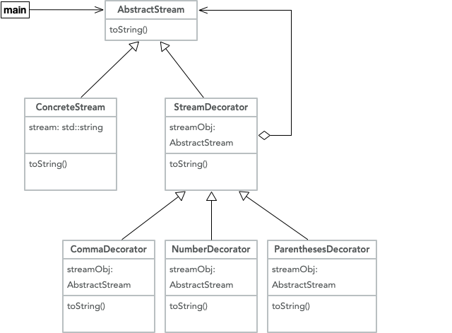

# VPL 4 - Decorator (5,0 pts)

* Disponível a partir de: domingo, 12 Jul 2020, 00:00

* Data de entrega: domingo, 20 Set 2020, 23:59

* Arquivos requeridos: AbstractStream.hpp, ConcreteStream.hpp, StreamDecorator.hpp, ParenthesesDecorator.hpp, CommaDecorator.hpp, NumberDecorator.hpp, ParenthesesDecorator.cpp, CommaDecorator.cpp, NumberDecorator.cpp, main.cpp (Baixar)

* Tamanho máximo de arquivo carregado: 1 MiB

* Tipo de trabalho: Trabalho individual

**Neste exercício você irá aprender sobre um padrão de projetos chamado Decorator. Trata-se de um dos 23 padrões de projetos do famoso livro conhecido como GoF (Gang of Four). Esse padrão de projetos permite alterar o comportamento de um objeto, de forma composicional. Em outras palavras, diferentes decoradores podem ser aplicados sobre o mesmo objeto. Por exemplo, se o objeto alvo é uma janela, você pode criar um decorador para adionar-lhe uma borda, e outro para lhe adicionar uma cor de fundo. E outros decoradores podem ser criados, mesmo depois que o programa já esteja em uso. Decorator é um padrão muito útil, e muito poderoso. Ele é um pouco difícil de compreender logo de início. Mas persevere: vale a pena entender como funcionam decoradores!**

**Nesse exercício faremos um decorador de strings. Esses strings serão chamados streams (é como se o string fosse um fluxo de caracteres). Você deverá implementar o modelo abaixo:**



*Diagrama de classes do programa proposto neste exercicio.*

**Parte desse modelo já está feita para você. Na verdade, quase o modelo inteiro já está implementado. Falta somente implementar os métodos toString() das classes NumberDecorator e CommaDecorator. Em outras palavras, você deverá, para terminar esse exercício, implementar os arquivos CommaDecorator.cpp e NumberDecorator.cpp. Os decoradores de nosso modelo são listados abaixo:**

* ParenthesesDecorator adiciona parênteses antes e depois do stream. Deve haver um espaço entre o primeiro parêntese e o início da string, e um parêntese entre o final da string e o último parêntese. Exemplo: "adf 34 12 fad 3.24 -4 df" se transforma em "( adf 34 12 fad 3.24 -4 df )".

* CommaDecorator adiciona vírgulas entre cada token que compõe a string. Um token é uma sequência de caracteres, sem espaços em branco. Deve haver sempre um espaço antes e após cada vírgula. Mas, se o stream final terá somente esses espaços. Em outras palavras, separare a string em tokens, e adicione esses grupos de espaço-vírgula-espaço entre cada token. Não deve haver vírgula no final do stream. Exemplo: "adf 34 12 fad 3.24 -4 df" se transforma em "adf , 34 , 12 , fad , 3.24 , -4 , df".

* NumberDecorator adiciona um sinal de mais (+) na frente de cada número inteiro que aparece no stream. Esse decorador também assegura que haverá sempre um espaço entre cada token to stream. Exemplo: "adf    34   12 fad  3.24    -4 df" se transforma em "adf +34 +12 fad 3.24 -4 df".

**Para testar sua implementação, use o programa abaixo:**

```
#include <iostream>
#include "ConcreteStream.hpp"
#include "ParenthesesDecorator.hpp"
#include "CommaDecorator.hpp"
#include "NumberDecorator.hpp"
AbstractStream* buildThreeBadFormat(std::string stream) {
  AbstractStream* abs = new ConcreteStream(stream);
  abs = new ParenthesesDecorator(abs);
  abs = new CommaDecorator(abs);
  return new NumberDecorator(abs);
}
AbstractStream* buildThreeGoodFormat(std::string stream) {
  AbstractStream* abs = new ConcreteStream(stream);
  abs = new NumberDecorator(abs);
  abs = new CommaDecorator(abs);
  return new ParenthesesDecorator(abs);
}
AbstractStream* buildParentheses(std::string stream) {
  AbstractStream* abs = new ConcreteStream(stream);
  return new ParenthesesDecorator(abs);
}
AbstractStream* buildCommas(std::string stream) {
  AbstractStream* abs = new ConcreteStream(stream);
  return new CommaDecorator(abs);
}
AbstractStream* buildIntegers(std::string stream) {
  AbstractStream* abs = new ConcreteStream(stream);
  return new NumberDecorator(abs);
}
int main() {
  std::string stream;
  std::getline(std::cin, stream);
  std::cout << buildThreeBadFormat(stream)->toString() << std::endl;
  std::cout << buildThreeGoodFormat(stream)->toString() << std::endl;
  std::cout << buildParentheses(stream)->toString() << std::endl;
  std::cout << buildCommas(stream)->toString() << std::endl;
  std::cout << buildIntegers(stream)->toString() << std::endl;
}
```

**Para lhe ajudar, um dos decoradores, ParenthesesDecorator, já está feito. Você pode se basear na implementação dele para implementar os outros dois decoradores. O arquivo de implementação segue abaixo:**

```
#include "ParenthesesDecorator.hpp"
std::string ParenthesesDecorator::toString() {
  return "( " + StreamDecorator::toString() + " )";
}
```

**Abaixo são vistos alguns casos de teste que você pode usar como exemplo:**

```
$> X=0; echo "adf 34 12 fad 3.24 -4 df" > t$X.txt ; ./a.out < t$X.txt
( , adf , +34 , +12 , fad , 3.24 , -4 , df , )
( adf , +34 , +12 , fad , 3.24 , -4 , df )
( adf 34 12 fad 3.24 -4 df )
adf , 34 , 12 , fad , 3.24 , -4 , df
adf +34 +12 fad 3.24 -4 df

$> X=1; echo "1 2 12 3 123" > t$X.txt ; ./a.out < t$X.txt
( , +1 , +2 , +12 , +3 , +123 , )
( +1 , +2 , +12 , +3 , +123 )
( 1 2 12 3 123 )
1 , 2 , 12 , 3 , 123
+1 +2 +12 +3 +123

$> X=2; echo "." > t$X.txt ; ./a.out < t$X.txt
( , . , )
( . )
( . )
.
.

$> X=3; echo "a b 1.2 -2 2 +2" > t$X.txt ; ./a.out < t$X.txt
( , a , b , 1.2 , -2 , +2 , +2 , )
( a , b , 1.2 , -2 , +2 , +2 )
( a b 1.2 -2 2 +2 )
a , b , 1.2 , -2 , 2 , +2
a b 1.2 -2 +2 +2

$> X=4; echo "1. .1 1.1 1" > t$X.txt ; ./a.out < t$X.txt
( , 1. , .1 , 1.1 , +1 , )
( 1. , .1 , 1.1 , +1 )
( 1. .1 1.1 1 )
1. , .1 , 1.1 , 1
1. .1 1.1 +1
```

---
Arquivos requeridos
AbstractStream.hpp, ConcreteStream.hpp, StreamDecorator.hpp, ParenthesesDecorator.hpp, CommaDecorator.hpp, NumberDecorator.hpp, ParenthesesDecorator.cpp, CommaDecorator.cpp, NumberDecorator.cpp, main.cpp, VPL
