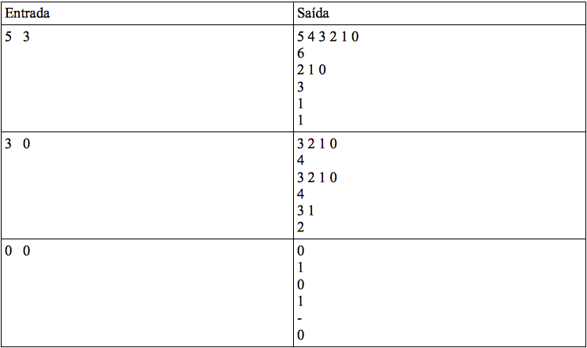

# Aula 05 - VPL 01 - Lista Problemática (4 pts)

## Data de entrega: segunda, 31 Ago 2020, 23:59

## Arquivos requeridos: main.cpp, List.hpp, List.cpp (Baixar)

Tipo de trabalho: Trabalho individual

### Descrição:

**Sua tarefa é modificar a função main para que ela execute as tarefas abaixo listadas, e corrigir a implementação do arquivo List.cpp.**

**O programa apresentado nesse exercício contem múltiplos erros intencionais para que seja possível reproduzir problemas muito comuns como segmentation fault, memory leak, e null pointer. Faz parte do exercício a interpretação e compreensão mais detalhada do código.**

### Tarefas:

1) Receba dois valores como entrada, N e K. 
2) Insira na lista os valores de [0,N]. Sua lista deve sempre inserir os números na primeira posição, de forma com que ela seja decrescente quando exibida sequencialmente. Atenção: o intervalo [0,N] é fechado!
3) Imprima os valores contidos na lista.
4) Imprima o tamanho da lista.
5) Remova os K  primeiro valores.
6) Imprima os valores contidos na lista.
7) Imprima o tamanho da lista.
8) Remova os valores pares existentes na lista.
9) Imprima os valores contidos na lista.
10) Imprima o tamanho da lista.

### Atenção:

1) Se a lista estiver vazia o programa deve imprimir uma linha com o caractere "-" (veja o terceiro exemplo) para a representar.
2) Nenhuma função não especificada no TAD é necessária. O uso de qualquer função extra será penalizado.
3) O seu programa será avaliado automaticamente em relação a saída, e manualmente para o erro de memory leak utilizando o Valgrind. Alunos que não resolverem problemas relacionados a memory leak serão penalizados no valor da nota final. Utilize o botão 'Depurar' para acessar o GDB e visualizar a saída do Valgrind.

Exemplos de execução:

