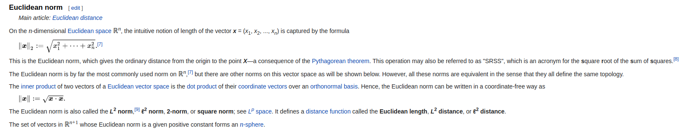

# VPL3 - Norma multi-dimensional (5,0 pts)

* Disponível a partir de: domingo, 12 Jul 2020, 00:00

* Data de entrega: domingo, 20 Set 2020, 23:59

* Arquivos requeridos: Vec.hpp, Vec1D.hpp, Vec2D.hpp, main.cpp, Vec1D.cpp, Vec2D.cpp, Vec3D.cpp, Vec3D.hpp (Baixar)

* Tamanho máximo de arquivo carregado: 1 MiB

* Tipo de trabalho: Trabalho individual

**O objetivo deste exercício é implementar um sistema que lê pontos da entrada padrão, um por linha, e imprime a soma da norma dos vetores que esses pontos representam. A definição de norma que deve ser usada é a de Norma Euclidiana. Para testar seu programa, você deverá usar o programa principal abaixo:**

---
```
#include <stdio.h>
#include <vector>
#include <iostream>
#include <sstream>
#include "Vec.hpp"
#include "Vec1D.hpp"
#include "Vec2D.hpp"
#include "Vec3D.hpp"
Vec* readNextPoint(std::string line) {
  std::istringstream ss(line);
  std::string token;
  std::getline(ss, token, ' ');
  double x = stod(token);
  if (std::getline(ss, token, ' ')) {
    double y = stod(token);
    if (std::getline(ss, token, ' ')) {
      double z = stod(token);
      return new Vec3D(x, y, z);
    } else {
      return new Vec2D(x, y);
    }
  } else {
    return new Vec1D(x);
  }
}
int main() {
  // read the file
  std::vector<Vec*> vecs;
  std::string line;
  while (std::getline(std::cin, line)) {
    // Convert the line into a point, and push it onto the vector:
    vecs.push_back(readNextPoint(line));
  }
  // Get the sum of norms:
  double norm = 0.0;
  for (Vec* v: vecs) {
    norm += v->get_norm();
  }
  printf("%.2lf\n", norm);
  return 0;
}
```

**Neste exercício teremos vetores de uma, duas ou três dimensões. Todos os vetores devem obedecer à interface abaixo:**

```
class Vec {
  public:
    virtual ~Vec() {};
    virtual std::string to_string() const = 0;
    virtual double get_norm() const = 0;
};
```

**Você deverá implementar as classes que estendem essa interface, a saber, Vec1D, Vec2D e Vec3D. A definição de cada uma das classes será provida para você. Use os seguintes casos de teste neste exercício:**

```
$> X=0; cat t$X.txt ; echo "--" ;./a.out < t$X.txt
0
1
2
3
--
6.00


$> X=1; cat t$X.txt ; echo "--" ;./a.out < t$X.txt
0 0
--
0.00


$> X=2; cat t$X.txt ; echo "--" ;./a.out < t$X.txt
1.0 0.0
0.0 1.0
--
2.00


$> X=3; cat t$X.txt ; echo "--" ;./a.out < t$X.txt
1.0 1.0 1.0
--
1.73


$> X=4; cat t$X.txt ; echo "--" ;./a.out < t$X.txt
0
1.2
1.1 2.3
-2.3 -5.4 10.11
-3.3 45.23
1.0 2.0 -3.5
3.4
2.76
--
71.10


$> X=5; cat t$X.txt ; echo "--" ;./a.out < t$X.txt
.0 .0 2.0
1.0 .0 .0
.0 3.0 .0
--
6.00
```

*Esse exercício ilustra o Princípio da Abertura-Fechamento, que diz que um programa deve ser aberto para extensão, e fechado para uso. Em outras palavras, é possível usar esse programa, porém, é também possível estendê-lo. A extensão se dá via herança. Mesmo após o programa já estar em produção, ainda é possível, por exemplo, criar pontos 4D ou 5D, sem que seja necessário alterar os outros tipos de pontos que já existem.*

---
## Apêndice

### Norma Euclicidana - Wiki

**Texto:** 

*"On the n-dimensional Euclidean space ℝn, the intuitive notion of length of the vector x = (x1, x2, ..., xn) is captured by the formula {\displaystyle \left\|{\boldsymbol {x}}\right\|_{2}:={\sqrt {x_{1}^{2}+\cdots +x_{n}^{2}}}.}{\displaystyle \left\|{\boldsymbol {x}}\right\|_{2}:={\sqrt {x_{1}^{2}+\cdots +x_{n}^{2}}}.}[7] This is the Euclidean norm, which gives the ordinary distance from the origin to the point X—a consequence of the Pythagorean theorem. This operation may also be referred to as "SRSS", which is an acronym for the square root of the sum of squares.[8] The Euclidean norm is by far the most commonly used norm on ℝn,[7] but there are other norms on this vector space as will be shown below. However, all these norms are equivalent in the sense that they all define the same topology.The inner product of two vectors of a Euclidean vector space is the dot product of their coordinate vectors over an orthonormal basis. Hence, the Euclidean norm can be written in a coordinate-free way as {\displaystyle \left\|{\boldsymbol {x}}\right\|:={\sqrt {{\boldsymbol {x}}\cdot {\boldsymbol {x}}}}.}\left\|{\boldsymbol {x}}\right\|:={\sqrt {{\boldsymbol {x}}\cdot {\boldsymbol {x}}}}. The Euclidean norm is also called the L2 norm,[9] ℓ2 norm, 2-norm, or square norm; see Lp space. It defines a distance function called the Euclidean length, L2 distance, or ℓ2 distance. The set of vectors in ℝn+1 whose Euclidean norm is a given positive constant forms an n-sphere."*



